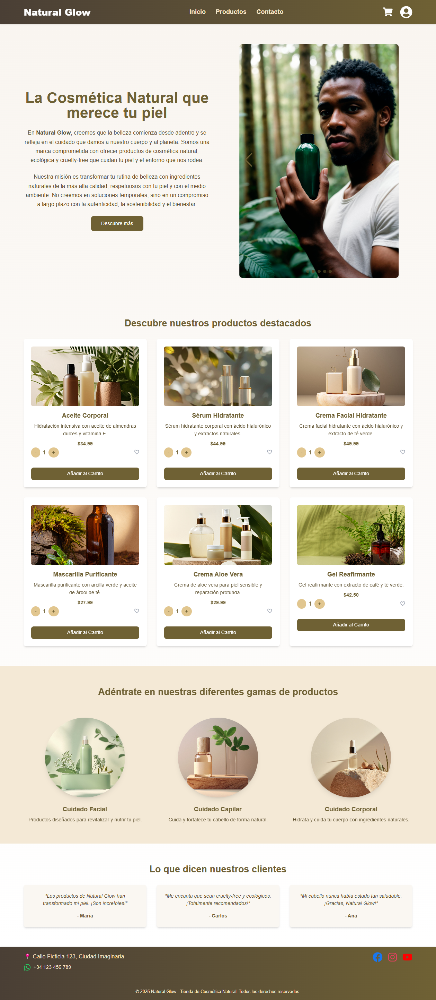
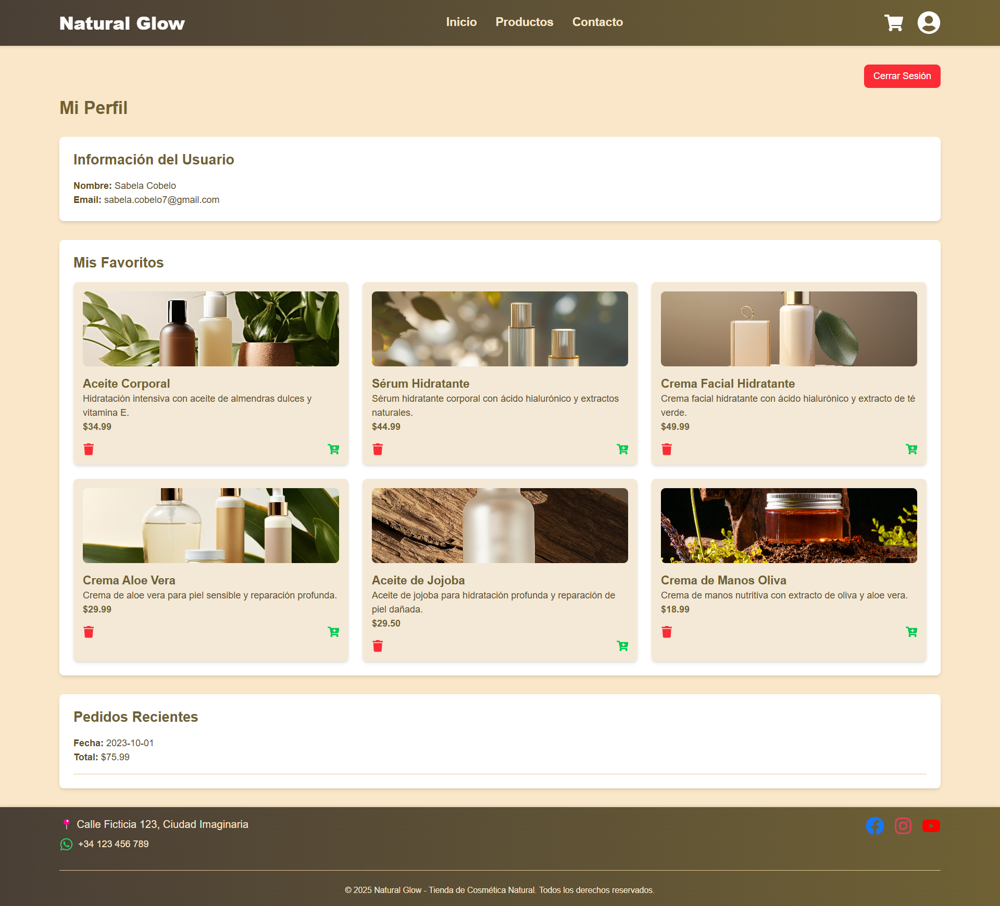

🌿 Tienda de Cosmética Natural - EcoBeauty 🌿
    Bienvenido a EcoBeauty, tu tienda en línea de cosmética natural. Este proyecto es una página web moderna y responsive desarrollada con React, Vite y TypeScript. Ofrece una experiencia de usuario intuitiva para explorar productos naturales, seleccionar cantidades, marcar favoritos y más.

✨ Características principales:
    🛍️ Catálogo de productos: Explora una amplia gama de productos naturales con imágenes, descripciones y precios.
    🔢 Selección de cantidad: Ajusta la cantidad de productos que deseas comprar.
    ❤️ Favoritos: Marca tus productos favoritos con un simple clic.
    📱 Diseño responsive: La página se adapta perfectamente a dispositivos móviles, tablets y desktop.
    🎨 Estilos modernos: Diseño limpio y atractivo con transiciones suaves.

🛠️ Tecnologías utilizadas
    ⚛️ React: Biblioteca de JavaScript para construir interfaces de usuario.
    🚀 Vite: Herramienta de construcción rápida y moderna.
    📘 TypeScript: Lenguaje que añade tipos estáticos a JavaScript para mayor seguridad.
    🎨 CSS: Estilos personalizados y diseño responsive.
    🔗 React Router: Navegación entre páginas.
    🔥 Firebase: Autenticación y base de datos en tiempo real.

🗂️ Estructura del proyecto:
    tienda-cosmetica-natural/
├── public/
│   └── img/                  # Imágenes de los productos
├── src/
│   ├── assets/               # Recursos estáticos (iconos, fuentes, etc.)
│   ├── components/           # Componentes reutilizables (Header, Footer, etc.)
│   ├── pages/                # Páginas de la aplicación (Home, Productos, etc.)
│   ├── styles/               # Archivos de estilos globales y por componente
│   ├── App.tsx               # Componente principal de la aplicación
│   ├── main.tsx              # Punto de entrada de la aplicación
│   └── vite-env.d.ts         # Tipos de Vite
├── .env                      # Variables de entorno
├── .gitignore                # Archivos y carpetas ignorados por Git
├── index.html                # Plantilla HTML principal
├── package.json              # Dependencias y scripts del proyecto
├── tsconfig.json             # Configuración de TypeScript
└── vite.config.ts            # Configuración de Vite

🚀 Cómo configurar el proyecto
    Sigue estos pasos para configurar y ejecutar el proyecto en tu máquina local.

    📋 Requisitos previos
    Node.js: Asegúrate de tener Node.js instalado. Puedes descargarlo desde nodejs.org.
    Git: Opcional, pero recomendado para clonar el repositorio.

    🛠️ Pasos para configurar
    Clona el repositorio (si estás usando Git):
        git clone https://github.com/tu-usuario/tienda-cosmetica-natural.git
        cd tienda-cosmetica-natural

    Instala las dependencias:
        npm installç

    Configura Firebase:
        Crea un proyecto en Firebase Console.
        Obtén las credenciales de Firebase (apiKey, authDomain, etc.).

    Crea un archivo .env en la raíz del proyecto y agrega las siguientes variables de entorno:
        VITE_FIREBASE_API_KEY=tu_api_key
        VITE_FIREBASE_AUTH_DOMAIN=tu_auth_domain
        VITE_FIREBASE_DATABASE_URL=tu_database_url
        VITE_FIREBASE_PROJECT_ID=tu_project_id
        VITE_FIREBASE_STORAGE_BUCKET=tu_storage_bucket
        VITE_FIREBASE_MESSAGING_SENDER_ID=tu_messaging_sender_id
        VITE_FIREBASE_APP_ID=tu_app_id
        VITE_FIREBASE_MEASUREMENT_ID=tu_measurement_id

    Configura las reglas de Firebase:
        Abre la consola de Firebase y ve a Realtime Database > Reglas.
        Actualiza las reglas para permitir el acceso a los productos:
                {
            "rules": {
                "Producto": {
                ".read": "true", // Permitir lectura a todos los usuarios
                ".write": "auth != null" // Permitir escritura solo a usuarios autenticados
                },
                "users": {
                "$userId": {
                    ".read": "$userId === auth.uid",
                    ".write": "$userId === auth.uid"
                }
                }
            }
        }
    Ejecuta el servidor de desarrollo:
        npm run dev

    Abre el proyecto en tu navegador:
        Visita http://localhost:5173 para ver la aplicación en acción.

    📜 Scripts disponibles
        npm run dev: Inicia el servidor de desarrollo.
        npm run build: Genera una versión optimizada para producción en la carpeta dist.
        npm run preview: Sirve la versión de producción localmente para pruebas.

    🌟 Capturas de pantalla

        ### 🏠 Página de inicio
        

        ### 🛍️ Página de productos
        

        ### 👤 Página de perfil del usuario
        

🎨 Paleta de Colores
    Fondo global: #FAE7C9 (beige claro).
    Texto global: #6F6134 (marrón oscuro).
    Header: #6F6134 (marrón oscuro) con texto #FAE7C9 (beige claro).
    Footer: #6F6134 (marrón oscuro) con texto #FAE7C9 (beige claro).
    Botones: #E1C68F (beige dorado) con texto #6F6134 (marrón oscuro).
    Favoritos: #E1C68F (beige dorado) y #6F6134 (marrón oscuro cuando está activo).

🤝 Cómo contribuir
    ¡Tu contribución es bienvenida! Si deseas mejorar este proyecto, sigue estos pasos:
    Haz un fork del repositorio.
    Crea una nueva rama: git checkout -b feature/nueva-funcionalidad.
    Realiza tus cambios y haz commit: git commit -m 'Añadir nueva funcionalidad'.
    Haz push a la rama: git push origin feature/nueva-funcionalidad.
    Abre un Pull Request en GitHub.

📄 Licencia
    Este proyecto está bajo la licencia MIT. Para más detalles, consulta el archivo LICENSE.

📧 Contacto
    Si tienes alguna pregunta, sugerencia o simplemente quieres saludar, no dudes en contactarme:

            👤 Nombre: Sabela Cobelo Losada

            📧 Email: sabela.cobelo7@gmail.com

            🐙 GitHub: SabelaCobelo

🌈 Agradecimientos
    Vite por la velocidad de desarrollo.
    React por la facilidad de construcción de interfaces.
    TypeScript por hacer el código más seguro y mantenible.
    Tú por visitar este proyecto. ¡Gracias! 😊

